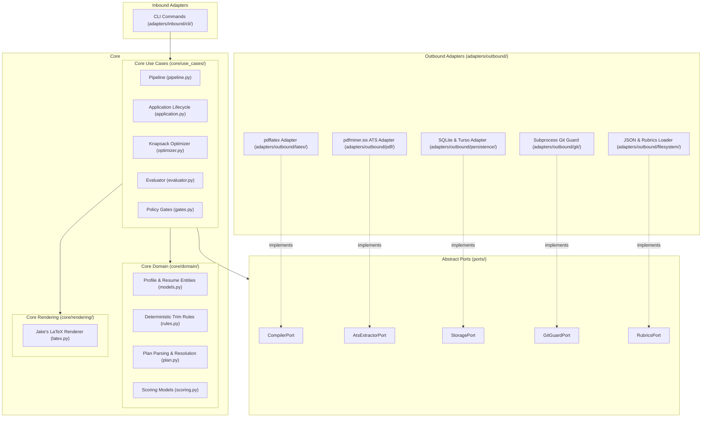

# SPEC-003: Hexagonal Architecture, Ports/Adapters & Legacy Topology

| Field | Value |
|---|---|
| **Spec ID** | `SPEC-003` |
| **Title** | Hexagonal Architecture, Ports/Adapters & Legacy Topology |
| **Status** | `Active` |
| **Author** | Simon Chen / LLM Agent Synthesis |
| **Created** | 2026-09-13 |
| **Updated** | 2026-09-21 |
| **Supersedes** | None |
| **Superseded By** | None |
| **Related Issues/PRs** | PR #86, PR #87 |

---

# Architecture Evolution & System Topology

This specification documents both the modern Hexagonal Architecture (Ports, Adapters, and Core) and the chronological path/module registry to prevent accidental resurrection of dead layouts.

---

## 1. Modern Hexagonal Architecture (Ports and Adapters)

To cleanly separate pure domain logic, rendering algorithms, and orchestration from external I/O, subprocesses, and cloud storage, the codebase is partitioned into three concentric layers:



### 1.1 Core Layer (`src/worksisyphus/core/`)
- **Domain (`core/domain/`)**: Pure domain models, entities, and business invariants with zero disk, network, or subprocess I/O.
  - `models.py`: Contact, Experience, Project, SkillCategory, Profile entities.
  - `rules.py`: Deterministic trim order, selection rules, and invariant predicates.
  - `plan.py`: Plan file parsing, slug resolution, and validation.
  - `gates.py`: GPA detection, banned content detection, LaTeX leak scanning, content density formulas.
  - `scoring.py`: Evaluation scorecards and ATS keyword match calculations.
- **Rendering (`core/rendering/`)**:
  - `latex.py`: Jake's template body assembly and preamble preservation. Escapes LaTeX special characters and formats sections in memory without altering the source template.
- **Use Cases (`core/use_cases/`)**: Orchestration workflows with explicit dependency injection:
  - `pipeline.py`: Trim-loop compiler execution, canonical 3-page compilation, and single-page fit resolution.
  - `application.py`: 1-step atomic application lifecycle, folder allocation (`applications/<YYYY-MM-DD>_<stem>[_N]`), and artifact persistence.
  - `optimizer.py`: Combinatorial knapsack plan search with role-specific guardrail enforcement.
  - `evaluator.py`: Resume evaluation against job descriptions and scoring criteria.
  - `hiring_agent.py`: Rubric compilation and criteria matching.
  - `gates.py`: Pipeline quality gate execution.

### 1.2 Ports Layer (`src/worksisyphus/ports/`)
Abstract Python protocols defining boundaries for all infrastructure and external interactions:
- `CompilerPort`: PDF compilation from LaTeX source and page count extraction.
- `AtsExtractorPort`: Text and layout extraction from compiled PDFs.
- `StoragePort`: Persistence of profiles, application metadata, evaluation logs, and cloud replication.
- `GitGuardPort`: Inspection of branch freshness and sync safety.
- `RubricsPort`: Ingestion of role evaluation criteria and prompt templates.

### 1.3 Adapters Layer (`src/worksisyphus/adapters/`)
Concrete implementations of the ports:
- `inbound/cli/`: Argparse CLI interface and subcommand routing.
- `outbound/latex/`: `pdflatex` compilation runner and temporary artifact manager.
- `outbound/pdf/`: `pdfminer.six`-backed ATS text and keyword extraction.
- `outbound/persistence/`: SQLite and Turso cloud database storage and schema manager.
- `outbound/git/`: Git branch and origin freshness verifier.
- `outbound/filesystem/`: Profile and rubric loader from filesystem JSON/Jinja files.

### 1.4 Facades Layer (`src/worksisyphus/*.py`)
Thin, zero-overhead backward-compatibility re-exports (e.g. `src/worksisyphus/pipeline.py`, `compiler.py`, `renderer.py`). These maintain 100% API compatibility for external scripts and legacy tests without duplicating logic.

---

## 2. Render Path & Data Flow

```
cli.apply  (or pipeline.tailor preview / pipeline.build_canonical)
  → profile_loader.load_profile          # missing file is fatal
  → validate_contact + cross_check_contact_against_db   # before pdflatex; mismatch blocks
  → plan.parse_plan                      # or optimizer.optimize_plan if apply omits --plan
  → rules.full_selection / rules.trim_step
  → latex.render_resume                  # validate_contact (non-empty); SoT preamble
  → compiler.compile_tex
  → gates.run_resume_gates → ats.check_pdf_ats
  → application.apply writes applications/<YYYY-MM-DD>_<stem>/  (os.replace)
  → db insert + git_guard → optional Turso   # skipped when no DB file; Turso errors warn only
```

---

## 3. Path Registry (Do Not Resurrect)

| Path | Born | Died | Replaced by | LLM Trap |
|------|------|------|-------------|----------|
| `master_resume.tex` | `d78f844` | `17b1e90` | `resumes_latex/` → `source_of_truth_resume.tex` | Root-level `.tex` master; `git log --follow` lands in ML variant |
| `tailored_resume.tex` | `d78f844` | `17b1e90` | renderer output / `tex_files/` | Single tailored TeX at repo root |
| `ai_agent_prompt.txt` | `d78f844` | `17b1e90` | `CLAUDE.md`, `GEMINI.md`, `.agents/` | Prompt `.txt` driving tailoring |
| `job_description.txt` | `d78f844` | `17b1e90` | `applications/*/jd.txt`; `--jd -` | Sample JD at root |
| `resumes_latex/` | `17b1e90` | `0af3a16` | `src/*.tex` | Multi-resume LaTeX folder |
| `job hunt/` | `191194d` | flattened `6ed0848` | hoisted to repo root | Prefixing `job hunt/` |
| `compile.sh` | `0af3a16` | — live | wraps `uv run python -m worksisyphus compile` | Assuming pdflatex is Python-only |
| `src/*.tex` (aclu_*, jakes_*, Simon_Chen) | `0af3a16` | `c8b2e27`–`06e3587` | SoT + in-memory body | Hand-editing per-role TeX |
| `src/worksisyphus/aggregator/` | `56767dc` | `6ed0848` | unrelated; gone | Job-ingest CLI under this package |
| `templates/` (`resume.json` → `experiences.json`) | `6ed0848` | `06e3587` | `profile.json` + SoT | `experiences.json` as SSoT |
| `templates/cover_letters/`, ACLU tex | `0af3a16` | `c8b2e27` | — | Civic/CRM template path |
| `src/{compile,generate,benchmark}.py` | `6ed0848` | `f3ca492` | `cli.py` | Top-level scripts |
| `src/tui.py` / package TUI | `c8b2e27` | `06e3587` | CLI + `apply` | Textual dashboard |
| `planner.py`, `benchmark.py`, `artifacts.py` | `e57ff6a` | `06e3587` | `plan.py` + `selection.py` | “Planner” module |
| `docs/deterministic-compiler-plan.md` | `e57ff6a` | `f3ca492` | README/CLAUDE/GEMINI | `docs/` plan |
| `archive.py` | `ba62443` | `a84b998` | `application.py` | `worksisyphus archive` |
| `profile.json` | `06e3587` | gitignored | local SSoT; `db sync` seeds SQLite | Committing it or expecting it in CI |
| `profile.example.json` | `8e89415` | `6640a8b` | `tests/fixtures/profile.json` | Template at repo root |
| `plans/`, `plans/example.json` | `06e3587` | `c3e22a0` | scratch + `applications/*/plan.json` | Recreating tracked `plans/` |
| `resumes/` | `f3ca492` | `edeb27c` | `applications/<date>_<stem>/Simon_Chen_Resume.pdf` | `resumes/<company>_resume.pdf` |
| `applications/` | `ba62443` | — live | sole delivery home | Expecting app history in git |
| `source_of_truth_resume.tex` | `643da17` | — live | preamble source | Editing preamble to squeeze content |
| `tests/fixtures/profile.json` | `dfa1022` | — live | CI/tests only | Using as production profile |
| `tex_files/` | `8c83568` | — partial | build scratch; only compiled canonical `.tex` tracked | Treating tailor output as delivered |
| `worksisyphus.db` | `99deed6` | gitignored | SQLite / Turso | Treating DB as render input |

---

## 4. Operational Invariants & Traps

1. **`plans/` is a dead path** (`c3e22a0`). Plans are transient inputs passed via stdin or scratch files; `apply` freezes them into `applications/<date>_<stem>/plan.json`.
2. **`resumes/` is a dead path** (`edeb27c`). Tailored resumes live solely inside `applications/<date>_<stem>/Simon_Chen_Resume.pdf`.
3. **Fixture Fallback Forbidden** in production (`e74bcee`/`652ff4f`). `tests/fixtures/profile.json` is strictly for tests and CI.
4. **Never Shrink LaTeX Margins or Preamble**: Fit is achieved by selecting fewer bullets or projects via the trim loop, never by altering typography or margins.
5. **DB is an Audit Store, Not Render Source**: Bullets, contact, and experiences are read from `profile.json`, never queried from SQLite during rendering.
